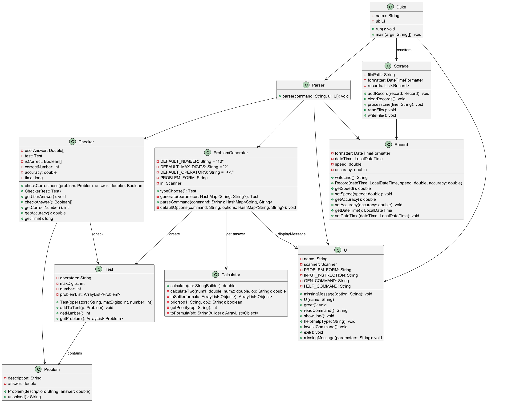
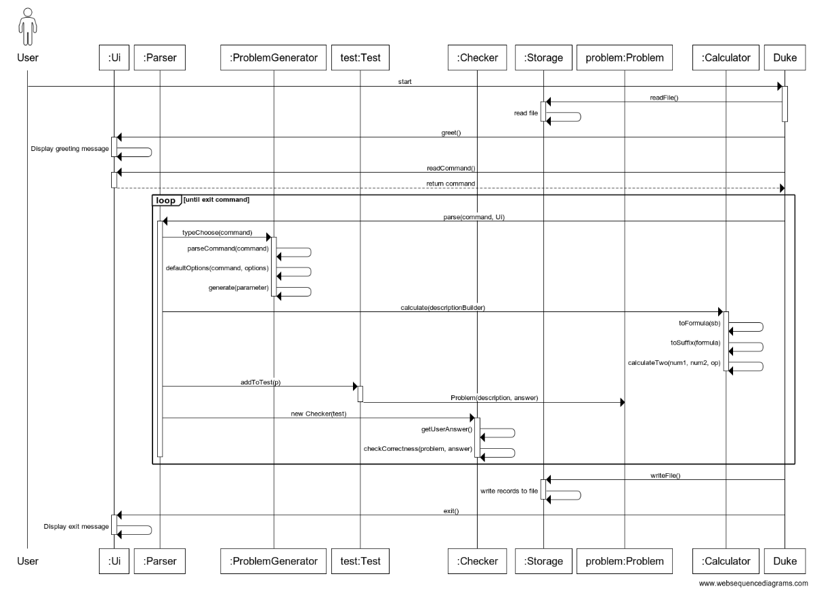

# Developer Guide

## Acknowledgements

We would like to acknowledge the following sources, which have been instrumental in the development of **MathGenius**:

- [Markdown Guide](https://www.markdownguide.org/): A free and open-source reference guide that explains how to use Markdown, the simple and easy-to-use markup language you can use to format virtually any document.
- [Stack Overflow](https://stackoverflow.com/): A platform for developers to learn, share their knowledge, and build their careers. We have referred to numerous threads on Stack Overflow to solve coding issues.

We would also like to thank all the developers and contributors of these projects for their valuable tools and resources.

## Design & implementation

### The Overall UML Diagram:
    

### The overall Sequence Diagram:
    


### ProblemGenerator Component
API: [ProblemGenerator.java](../src/main/java/seedu/duke/ProblemGenerator.java)

The `ProblemGenerator` component is designed to generate a set of math problems based on user-specified parameters. 

Users trigger the generator by entering a command in the following format:

    generate -t [operators] -n [number] -d [maximum digit] -l[length]
For example, a user might enter:

    generate -t +-*/ -n 10 -d 2 -l 3

#### Command Parsing
The `parseCommand()` function takes the user's command and extracts the parameters, which are then passed to the `generate()` function.

#### Problem Generation
The `generate()` function creates a single math problem by choosing three random operands (each with a maximum of two digits) and a random operation from the set of operators (+, -, *, /). This process is repeated the specified number of times to create a set of problems.

#### Default Options
If a user omits some parameters, the `defaultOptions()` function fills in the gaps with pre-set default options. The UI then prints a message for each missing parameter to inform the user.

#### Answer Calculation
The `Calculator` class calculates the answer to each problem during problem generation. The answer is then stored in the `Problem` class for later use.


### Checker Component  
**API：[Checker.java](../src/main/java/seedu/duke/Checker.java)**   

#### How `Checker` Works:
1. Each `Checker` instance is created with a `Test` class.
2. The `Checker` prompts for user input and compares the answer with a tolerance of up to 2 decimal places.
3. If the user input is not a number, the answer is automatically marked as incorrect.
4. The accuracy and the user's answers are stored for UI or other classes to access with specific functions.
5. The `Checker` also records the time taken by the user to solve the problem set.
6. The `Checker` stores the questions for which the user provided a wrong answer, as well as the incorrect answers.
    
#### Pseudo Code for Reference:

```
correct = 0
isCorrect = []
wrongProblem = []
wrongAnswer = []
for problem in problem set: 
    UI.PrintProblem
    answer <- user_input
    if answer - problem.answer < teleranceRange
        correct <- correct+1
        isCorrect.append("1")
    else
        isCorrect.append("0")
        wrongProblem.append(problem)
        wrongAnswer.append(userInput)
        continue
```
#### Future Enhancements for `Checker.java`:

1. Support checking more types of problems (e.g., Quadratic equations).
2. Providing explanations for the math problems.
3. Storing the answer in array format to handle function and matrix answers.

### Record Component

API: [Record.java](../src/main/java/seedu/duke/Record.java)

#### Design

The `Record` component is a snapshot of completed problem sets. It includes:

- Individual problems
- The date the problem set was solved
- The time taken to solve the problem set
- The accuracy of the attempt

Each `Record` also stores the specifics of each problem and a unique ID (created using Java's default `hashCode`) for organized or filtered viewing of past records.

Users can choose whether to display the problem set specifics or not using the `showProbDetails` parameter.

When writing a record to an external file, it's written into a single line in the format of "/dateTime(format:yyyy-MM-dd HH:mm:ss) /speed /accuracy /problemSetID /problems". For problems, each problem is separated by a space and is formatted in "/problemDescription,/problemAnswer".

The unique ID for problem sets can be used in the `retry` command to uniquely locate any problem set for the users to retry a previous problem set.

#### Implementation

- Each `Record` object stores an ArrayList of `Problem` objects for storing specifics of the attempted Problem Set.

- When a problem set solving is saved to a record **for the first time**, the corresponding `Record` object will create a unique ID for the problem set using Java's built-in `hashCode` method. When loading this record in the future and re-saving the data, the same ID will be used, and no new IDs will be generated. This is achieved by using two different constructors for these two different situations.

- Another purpose for the two different constructors: the first one does not include a preset problem set ID as an argument. This is used when the problem set the users solved is done through the `generate` command. Each generated problem set will automatically be assigned a random hashcode as its ID. The second one does contain a problem set ID as an argument, and this is for when the user uses the `retry` command to retry a past problem set in the records. Thus, the new record should use the same ID as the last, since it's the same problem set.

**Code Snippet**
```
// the two different constructors
public Record(LocalDateTime dateTime, double speed, double accuracy, ArrayList<Problem> probSet) {
   setSpeed(speed);
   setAccuracy(accuracy);
   setDateTime(dateTime);
   setProbSet(probSet);
   psIndex = probSet.hashCode();
}

public Record(LocalDateTime dateTime, double speed, double accuracy, ArrayList<Problem> probSet, int psIndex) {
   setSpeed(speed);
   setAccuracy(accuracy);
   setDateTime(dateTime);
   setProbSet(probSet);
   setPsIndex(psIndex);
}
```
### Storage Component

API: [Storage.java](../src/main/java/seedu/duke/Storage.java)

#### Design

The Storage Component:

- Read / Write to external files at appropriate runtime to enable data persistence throughout multiple usages of the software.
- A unique and strict format for external file formatting for proper loading data as well as input file corruption detection.
- Incorporate the UI and Parser components for proper user feedback regarding the save/load process.
- stores a list of Record objects for reading/writing. Each Record is stored on a single, separate line. The formatting of each line is explained in the Record section.
- The record list can be sorted by multiple parameters, including dateTime, speed, accuracy, and problem set ID. This is used by the UI component to display users' past records in any order they desire. 

### Implementation

- Uses a list of Record objects to store all past attempts
- Uses Java's built-in BufferedReader, FileReader, BufferedWriter, and FileWriter to write/read properly all information of all problem sets
- sortRecords method sorts the Record list based on 4 different parameters(each representing sort by datetime, speed, accuracy, problemSet ID). Each parameter has 3 different values: 0, 1, 2. 0 means to not sort by this parameter, 1 means to sort(decreasing order), 2 means to sort in reverse(increasing order). These 4 parameters are determined by the user input, and interpreted by the Parser component.

### DIYProblemSet Component

The DIYProblemSet class is responsible for creating and managing a user-defined problem set. It allows users to input custom problems and their correct answers, and saves the problem set for future reference.
 ## Class Signature
 ```
     public class DIYProblemSet {
        ArrayList<Problem> problemSet;
        
        public DIYProblemSet() {
            // Constructor logic
        }
        
        public void addDIYProblemSet(Ui ui) {
            // Method logic
        }
    }
```
#### Class Variables

    problemSet: An ArrayList of type Problem to store the user-defined problems.

#### Class Methods
    
```
    public DIYProblemSet()
```
  The constructor initializes the problemSet as a new ArrayList of Problem objects.

```
    public void addDIYProblemSet(Ui ui)
```
  This method allows users to input their DIY problem set. It prompts for the problem description and correct answer, validates the input, and adds the problem to the problemSet. Once the user finishes adding problems, it creates a new Record object with the current timestamp, total correct answers set to 0, total time taken set to 0, the problemSet, and the problem set type as USER_DIY. It then saves the record using the Storage.addRecord() method and displays a success message along with the details of the saved problem set.

#### Method Flow

1. Create a new Scanner object to read user input.
2. Prompt the user to input their DIY problem set.
3. Inside a loop that continues until the user indicates they have finished adding problems:
   - Prompt the user to input the problem description.
   - Prompt the user to input the correct answer for the problem.
   - Validate the input by attempting to parse the correct answer as a double. If it fails, display an error message.
   - Create a new Problem object with the description and parsed answer, and add it to the problemSet.
   - Prompt the user to indicate if they have finished adding problems (y for yes, n for no).
   - Validate the input to ensure it is either y or n. If it is invalid, display an error message and prompt again.
4. Create a new Record object with the current timestamp, total correct answers set to 0, total time taken set to 0, the problemSet, and the problem set type as USER_DIY.
5. Save the record using the Storage.addRecord() method.
6. Display a success message indicating that the DIY problem set has been successfully saved.
7. Print the details of the saved problem set using the record.print(true) method.
8. Display a new line for formatting purposes.

### Testcase Component

#### Proposed Implementation
 The proposed test mechanism is facilitated by ProblemGeneratorTest, CheckerTest. It check the correctness of the generated problemsets' types,
number of questions and max digits, by comparing the generated output to the user input.

    ProblemGeneratorTest#operatorTest() — Test if the input operator type is align with the generated one.
    ProblemGeneratorTest#numberTest() — Test if the input number of questions is align with the generated number of questions.
    ProblemGeneratorTest#digitTest() — Test if the input max digits is align with the generated one.
    ProblemGeneratorTest#parseCommand() — parse the input command to fit in the program.
    ProblemGeneratorTest#parseNumber() — parse out the operands from a given problem.

Given below is an example usage scenario and how the test behaves.

- Step 1. The user launches the ProblemGeneratorTest and runs the operator test case. The ProblemGeneratorTest#operatorTest() will loop through all the 
commands in the data member "commands" and allocate each command to its corresponding test case. During this process, a ProblemGenerator pb is 
generated, and the problem sets it generates by calling ProblemGenerator#typeChoose will be stored in variable #test#, then the problem set will be
extracted using Test#getProblem(). After that, for every problem in the generated problem set, the assertTrue will check if the type of these problems 
matches with the user input type. If all of them match, it will successfully output the generated dataset, otherwise, it will output the problem with 
incorrect format.

- Step 2. The user launches the ProblemGeneratorTest and runs the number test case. The ProblemGeneratorTest#numberTest() will loop through all the commands
in the data member #commands# and call ProblemGeneratorTest#parseCommand to parse the input command to get a hashmap with the input type, number, and digits
information. Then generate a new ProblemGenerator and use ProblemGenerator#typeChoose to collect the generated problem, then use assertEquals to compare 
the user input number with the generated number of questions.

- Step 3. The user launches the ProblemGeneratorTest and runs the digit test case. The ProblemGeneratorTest#digitTest() will loop through all the commands
in the data member #commands# and call ProblemGeneratorTest#parseCommand to parse the input command to get a hashmap with the input type, number, and digits
information. Then generate a new ProblemGenerator and use ProblemGenerator#typeChoose to collect the generated problem, then for every problem, call 
ProblemGeneratorTest#parseNumbers to extract the digits in the problem, then use assertTrue to verify if the input max digit is greater or equal to the digits
of every operand in the generated problems.

The features going to be implemented:
  test cases for generating long problem set questions and check answers, as well as the test cases for UI, Checker, and Storage.

Details for implementation:

1. Testcases for generating long problem sets questions:
   Implement specific input and call assertTrue to verify if the generated long problem sets have the desired format.
2. Testcases for checker :
   provide answers to sample test cases and verify if the checker outputs accurate correctness.
3. Cases for UI:
   Verify the UI output's correctness.
4. Storage:
   Verify that the record file has been created and that the content in the file is correct.

## Product scope
### Target user profile

* The student who wishes to practice their mathematical problem-solving ability.  
* The teachers who wish to teach students math problems and check their performance.  

### Value proposition

The product automates the generation of mathematical problems and their corresponding answers, thereby reducing the effort required by students to find practice problems.

## User Stories

|Version| As a ... | I want to ... | So that I can ...|
|--------|----------|---------------|------------------|
|v1.0|student who just started learning quadratic equations|use MathGenius to specifically generate problem sets|gain specialized practice on this topic|
|v1.0|a student who’s unfamiliar with mathematics terms|watch explanations and introductions to unfamiliar terms|strengthen understanding|
|v1.0|primary school teacher|wcreate course or topic-specific arithmetic questions for students|teaching student more effortlessly|
|v2.0|student who want to pracise solving foumula|generate various kinds of formula|practise the ability of solving math formula|
|v2.1|student who want to pracise solving foumula|i want to have a smooth and user friendly program|enhance my Math ability efficiently|

## Non-Functional Requirements
1. Should work on any mainstream OS as long as it has Java 11 or above installed.  
2. A user with above-average typing speed for regular English text (i.e. not code, not system admin commands) should be able to accomplish most of the tasks faster using commands than using the mouse.   
    
**{More to be added}**

## Glossary

* Mainstream OS: Windows, Linux, Unix, MacOS  
* Private contact detail: A contact detail that is not meant to be shared with others  

## Instructions for manual testing

## Launch and Shutdown
   1. initial launch:
      1. Download the jar file and copy it into an empty folder
      2. Run the jar file using the command '_java -jar tp.main.jar_'
   2. Saving window preferences

      1. Resize the window to an optimum size. Move the window to a different location. Close the window.

      2. Re-launch the app by double-clicking the jar file.
         Expected: The most recent window size and location are retained.
   3. Shutdown
      1. Input the command '_exit_' in the terminal after launching the program.
## Generate ProblemSet
   1. generate expected problem set by input its type('+ or - or * or /'), number of problems(integer) and
      the maximum digits.
      1. the example input: 'generate -t + -n 2 -d 3', which means generate a problem set, that has 2 problems,
         all of their operators are '+', and the maximum digit of their operands is 3 digits.
      2. input the answer: after all problems are generated, every problem will show on the terminal again,
         user can type his answer in the blank. Then the next problem will show as follows. After the user types in
         all the answers, the accuracy of his performance and his speed will be shown as follows, e.g. 
        'Acc: 0.0
         Spend Time: 121s' .
   2. after shutting down the program, the user can view his performance report in a .txt file called 'recordList.txt' 
      with the complete date and accuracy inside.

